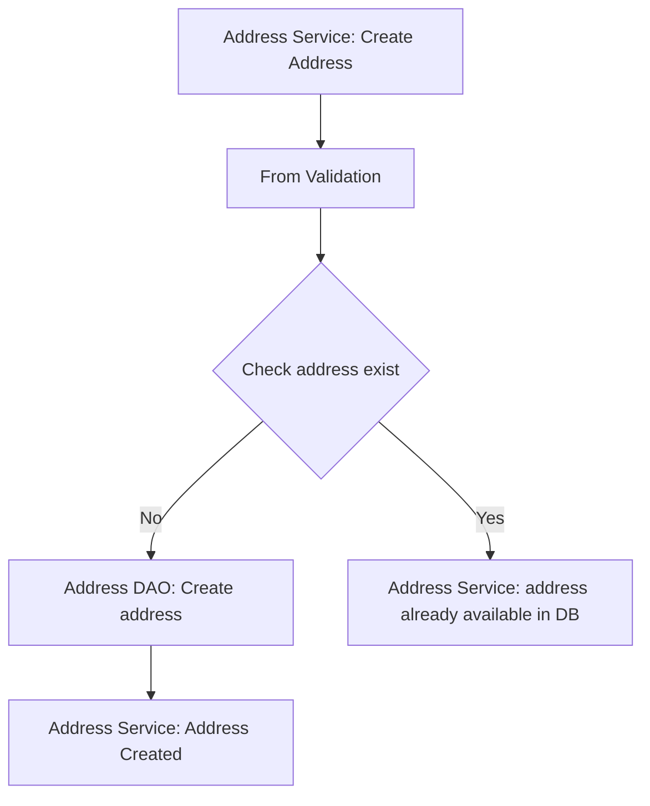
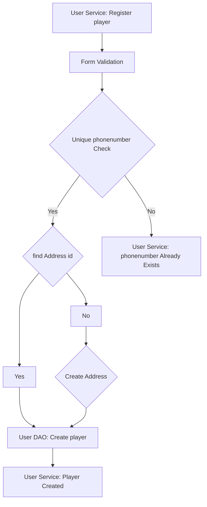
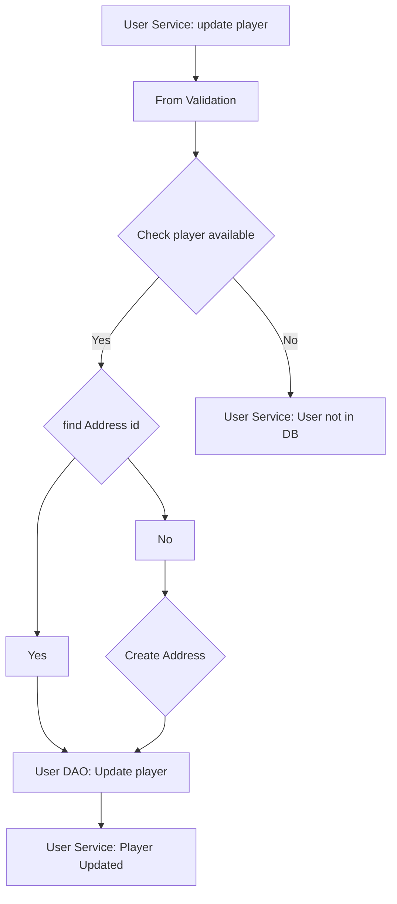
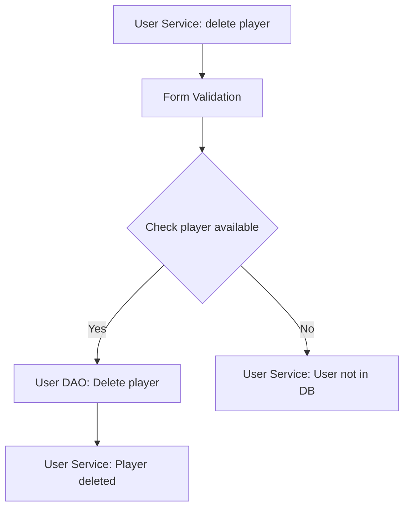
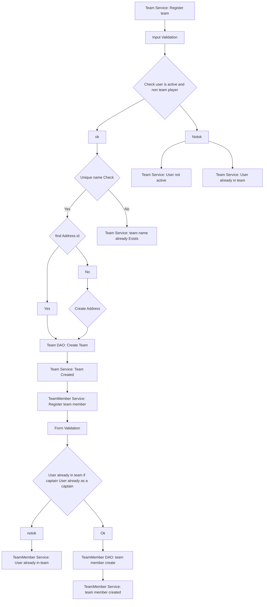
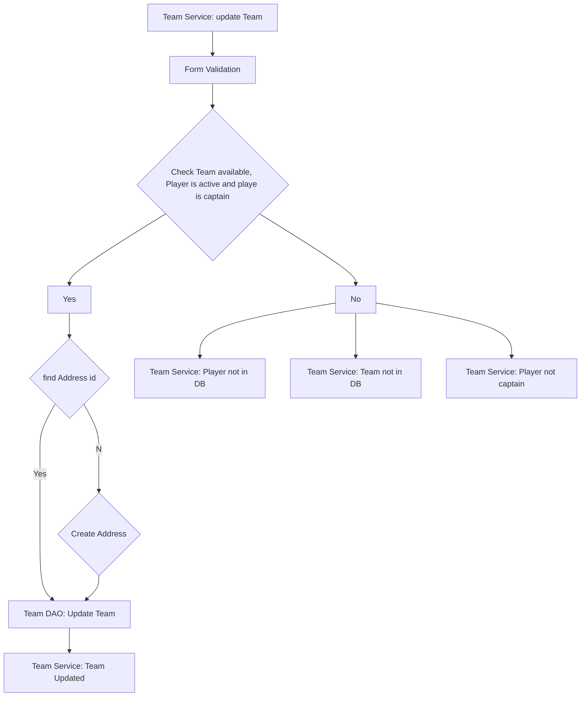
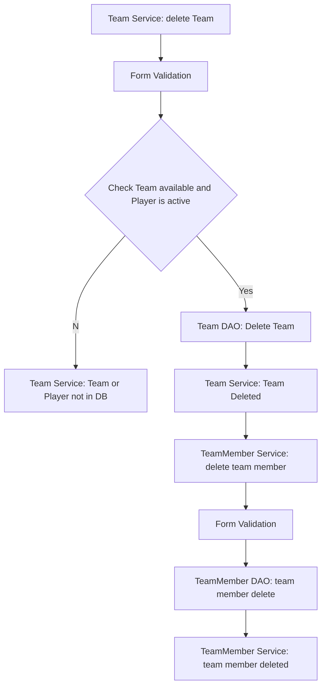
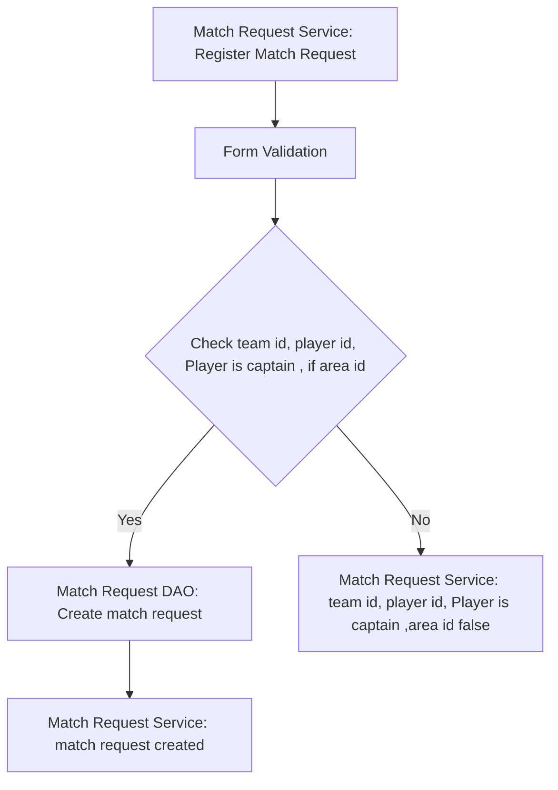
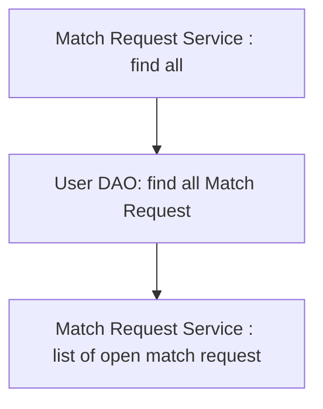

# Sports Hub App Checklist

## Database Design

- [ ] Create an ER diagram of the database- 
- [ ]  [ ] Write Create table scripts [script](src/main/resources/db/migration/V1__create_users.sql)


## Project Setup

- [ ] Create a new Java project
- [ ] Set up a MySQL database
- [ ] Add necessary libraries
	- [ ] JDBC, 
	- [ ] MySQL Connector, 
	- [ ] JUnit, 
	- [ ] Dotenv

## Module: Address

### Feature 1: Create Address
#### Uses:
	Creating address by area and district data.
	
#### Pre-requisites:
- [ ] Create Address table
- [ ] implement Address model
- [ ] Implement Address Service(create)
- [ ] Implement Address DAO (create)

#### Validations:
- [ ] Implement address input validation (area, district)
- [ ] Check address already exist

#### Exception Message:
 - Area can't be null or empty
 - Address does not match pattern
 - District can't be null or empty
 - District does not match pattern
 - address already available.
 
#### Flow: 


### Feature 2: List Address
#### Uses:
	Get List of Address data.
	
#### Pre-requisites:
- [ ] Address module feature 1 should complete
- [ ] implement Address model
- [ ] Implement Address Service(List All)
- [ ] Implement Address DAO (List All)

#### Validations:

#### Flow: 
```mermaid
graph TD;
  A[Address Service: List Address] --> E[Address DAO: Get all address]
  E --> H[Address Service: List of address]
  ```


### Feature 3: Find by 
#### Uses:
	Find address id by address name.
#### Pre-requisites:
- [ ] Create Address table
- [ ] implement Address model
- [ ] Implement Address Service(Find by)
- [ ] Implement Address DAO (Find by)

#### Validations:
- [ ] Implement Player input validation (area, district)
- [ ] Check address already exist

#### Exception Message:
 - Area can't be null or empty
 - District can't be null or empty

#### Flow: 
```mermaid
graph TD;
  A[Address Service: Find by Address] --> B[From Validation]
  B -- Yes --> E[Address DAO: find address]
  B -- No --> F[Address Service: address not available in DB]
  E --> H[Address Service: Address found]
```

## Module: Player

### Feature 1: Create Player
#### Uses:
	Create new player in DB.
	
#### Pre-requisites:
- [ ] Address module feature 1 should complete
- [ ] Create Player table
- [ ] Implement Player model
- [ ] Implement Player Service(create)
- [ ] Implement Player DAO (create)

#### Validations:
- [ ] Implement Player input validation (Phone number, password, username, first name, gender, area, district, date of birth)
- [ ] Implement Phone number uniqueness check
- [ ] Check address already exist if not create new address

#### Exception Message:
 - Invalid phone number
- password can't be null or empty
 - Invalid password
 - User name can't be null or empty
 - User name does not match pattern
 - First name can't be null or empty
 -  First name does not match pattern
 - Area can't be null or empty
 - Area  does not match pattern
 - District can't be null or empty
 - District does not match pattern
 - Invalid date of birth
 - invalid date of birth pattern
 - gender should be 1 and 2
 - phone number already exist
 - address not exist in DB

#### Flow: 


### Feature 2: Update Player
#### Uses:
		Update exist player in data base.
#### Pre-requisites:
- [ ] Player module feature 1 should complete
- [ ] Implement Player Service(Update)
- [ ] Implement Player DAO (Update)

#### Validations:
- [ ] Implement Player input validation (password, username, first name, gender, area, district, date of birth)
- [ ] Check player available in DB
- [ ] Check address already exist if not create new address

#### Exception Message:
 - invalid id
 - password can't be null or empty
 - Invalid password
 - User name can't be null or empty
 - User name does not match pattern
 - First name can't be null or empty
 -  First name does not match pattern
 - Area can't be null or empty
 - Area  does not match pattern
 - District can't be null or empty
 - District does not match pattern
 - Invalid date of birth
 - invalid date of birth pattern
 - gender should be 1 and 2
 - address not exist in DB
 - player not available in DB
 
#### Flow: 


### Feature 3: Delete Player
#### Uses:
		delete exist player in data base.
#### Pre-requisites:
- [ ] Player module feature 1 should complete
- [ ] Implement Player Service(Delete)
- [ ] Implement Player DAO (Delete)

#### Validations:
- [ ] Check player available in DB

#### Exception Message:
 - invalid id
 - player not available in DB
 
#### Flow: 


## Module: Team

### Feature 1: Create Team
#### Uses:
	Create new Team in DB.
	
#### Pre-requisites:
- [ ] Player module feature 1 should complete
- [ ] Create Team table
- [ ] Create Team Member table
- [ ] Implement Team model
- [ ]  Implement Team Member model
- [ ] Implement Team Service(create)
- [ ] Implement Team Member Service(create)
- [ ] Implement Team DAO (create)
- [ ] Implement Team Member DAO (create)

#### Validations:
- [ ] Implement Team input validation (Name, area, district, created by)
- [ ] Implement Team input validation (team id , user id)
- [ ] Validate user id already exist
- [ ] Validate User already in team.
- [ ] Implement name uniqueness check
- [ ] Check address already exist if not create new address

#### Exception Message:
 - invalid player id
 - Team name can't be null or empty
 - Team name does not match pattern
 - Area can't be null or empty
 - Area  does not match pattern
 - District can't be null or empty
 - District does not match pattern
 - address not exist in DB
 - Player already in team
 - Player not active
 - team name already exist
 - Invalid team id
 - player already as captain

#### Flow: 

### Feature 2: Update Team
#### Uses:
	Update existing Team in DB.
	
#### Pre-requisites:
- [ ] Player module feature 1 should complete
- [ ] Team module feature 1 should complete
- [ ] Implement Team Service(Update)
- [ ] Implement Team DAO (Update)

#### Validations:
- [ ] Implement team input validation ( about , area, district, name , modified by id)
- [ ] Check team available in DB
- [ ] Check player available in DB
- [ ] Check address already exist if not create new address

#### Exception Message:
- invalid player id
-  Invalid team id
 - Team name can't be null or empty
 - Team name does not match pattern
 - Area can't be null or empty
 - Area  does not match pattern
 - District can't be null or empty
 - District does not match pattern
 - address not exist in DB
 - team name already exist
 - Player not active
 - Player not a captain
 - team not available exist in DB
 
#### Flow: 


### Feature 3: Delete Team
#### Uses:
	Delete existing Team in DB.
	
#### Pre-requisites:
- [ ] Player module feature 1 should complete
- [ ] Implement Team Service(Delete)
- [ ] Implement Team DAO (Delete)
- [ ] Implement Team Member Service(Delete)
- [ ] Implement Team Member DAO (Delete)
#### Validations:
- [ ] Check player available in DB
- [ ] Check Team available in DB

#### Exception Message:
-  invalid player id
-  Invalid team id
 - Player not active
 - Player not a captain
 - team not available exist in DB
 
#### Flow: 


## Module: Matches

### Feature 1: Create Match Request
#### Uses:
	Create new match request in DB.
	
#### Pre-requisites:
- [ ] Player module feature 1 should complete
- [ ] Team module feature 1 should complete
- [ ] Create Match Request table
- [ ] Create Request Response table
- [ ] Implement Match Request model
- [ ] Implement Request Response model
- [ ] Implement Match Request Service(create)
- [ ] Implement Match Request DAO (create)
- [ ] Implement Request Response Service(create)
- [ ] Implement Request Response DAO (create)

#### Validations:
- [ ] Implement Match Request input validation (from team id, created by id , to team or to area , type of match , member count , age from, age to , match time , location)
- [ ] Check team id, player id , Player is captain , if area id 

#### Exception Message:
- invalid created by id
- created by id not exist
-  Invalid to team id
 - to team not exist in DB
 - invalid address id
 - address not exist in DB
 - invalid type of match
 - member count should be with in 3 to 15
 - from age min 15 and max 60
 - to age min 15 and max 60
 - match time not match pattern
 - match time should be in future
 - location can't be null or empty


#### Flow: 


### Feature 2: View all open Match Request
#### Uses:
	Get all open match request data from DB.
	
#### Pre-requisites:
- [ ] Matches module feature 1 should complete
- [ ] Implement Match Request Service(find all)
- [ ] Implement Match Request DAO (find all)

#### Validations:

#### Flow: 

